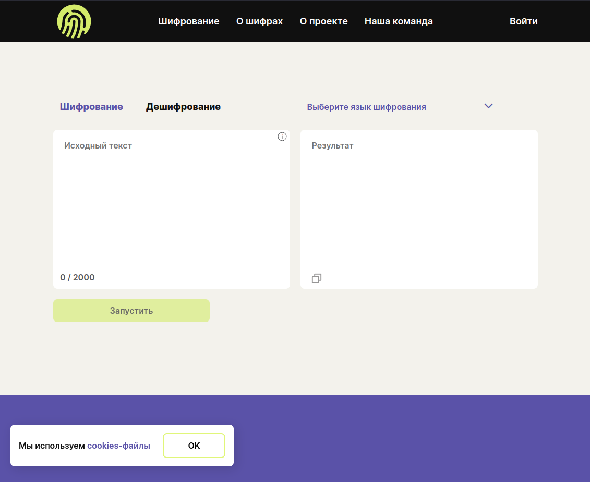

  
  
   
  
  <h1>Шифровальная машина</h1>
  
  <a href='http://shifmachine.acceleratorpracticum.ru'>http://shifmachine.acceleratorpracticum.ru</a>

**Текущий репозиторий является frontend частью проекта "[Шифровальная машина](https://github.com/encryption-machine)"**

### Шифровальная машина - это онлайн сервис шифрования текстовых сообщений. Разработан выпускниками [Яндекс.Практикума](https://practicum.yandex.ru), силами команд:
- Frontend разработчиков
- Backend разработчиков ([backend часть проекта](https://github.com/encryption-machine/Back))
- UX/UI дизайнеров ([макет дизайна](https://www.figma.com/file/sXoX6dcw6Z1RoAZCmAe6BA/%D0%A8%D0%B8%D1%84%D1%80%D0%BE%D0%B2%D0%B0%D0%BB%D1%8C%D0%BD%D0%B0%D1%8F-%D0%BC%D0%B0%D1%88%D0%B8%D0%BD%D0%B0-(%D0%94%D0%B8%D0%B7%D0%B0%D0%B9%D0%BD)?type=design&node-id=7-5365&mode=design&t=7Oe5wcxCmfiithct-0))
- Project менеджеров
- QA инженеров

## Стэк:

## Фич-лист:
- Шифрование/дешифрование алгоритмами:
  - AES
  - Виженер
  - Цезарь
  - Морзе
  - QR (Только шифрование)
- Регистрация/вход пользователя
- Сброс пароля
- Личный кабинет с историей шифрования/дешифрования

## Контрибьюторы

